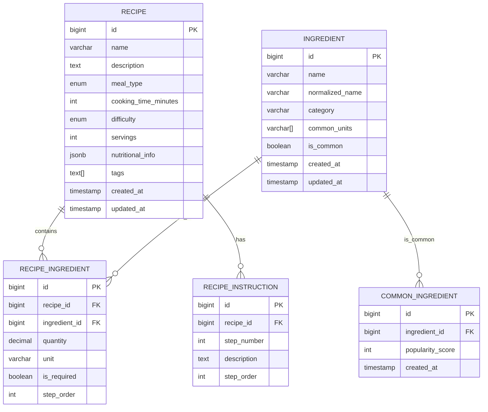

# Database Design - Infinite Recipe Book

## Overview
This document outlines the database schema design for the Infinite Recipe Book API. The design focuses on supporting intelligent recipe generation based on available ingredients, with proper normalization and performance considerations.

## Database Technology
- **Database**: PostgreSQL 14+
- **ORM**: JPA/Hibernate
- **Migration Tool**: Flyway
- **Connection Pool**: HikariCP

## Entity Relationship Diagram (UML)



## Entity Definitions

### 1. Recipe Entity
The core entity representing a recipe with all its metadata.

```java
@Entity
@Table(name = "recipes")
public class Recipe {
    @Id
    @GeneratedValue(strategy = GenerationType.IDENTITY)
    private Long id;
    
    @Column(nullable = false, length = 255)
    private String name;
    
    @Column(columnDefinition = "TEXT")
    private String description;
    
    @Enumerated(EnumType.STRING)
    @Column(name = "meal_type", nullable = false)
    private MealType mealType;
    
    @Column(name = "cooking_time_minutes")
    private Integer cookingTimeMinutes;
    
    @Enumerated(EnumType.STRING)
    private Difficulty difficulty;
    
    private Integer servings;
    
    @Column(name = "nutritional_info", columnDefinition = "JSONB")
    private NutritionalInfo nutritionalInfo;
    
    @Column(columnDefinition = "TEXT[]")
    private List<String> tags;
    
    @Column(name = "created_at")
    private LocalDateTime createdAt;
    
    @Column(name = "updated_at")
    private LocalDateTime updatedAt;
    
    @OneToMany(mappedBy = "recipe", cascade = CascadeType.ALL, orphanRemoval = true)
    private List<RecipeIngredient> ingredients = new ArrayList<>();
    
    @OneToMany(mappedBy = "recipe", cascade = CascadeType.ALL, orphanRemoval = true)
    @OrderBy("stepOrder ASC")
    private List<RecipeInstruction> instructions = new ArrayList<>();
}
```

### 2. Ingredient Entity
Represents individual ingredients with normalization support.

```java
@Entity
@Table(name = "ingredients")
public class Ingredient {
    @Id
    @GeneratedValue(strategy = GenerationType.IDENTITY)
    private Long id;
    
    @Column(nullable = false, length = 255)
    private String name;
    
    @Column(name = "normalized_name", length = 255)
    private String normalizedName;
    
    @Column(length = 100)
    private String category;
    
    @Column(name = "common_units", columnDefinition = "VARCHAR[]")
    private List<String> commonUnits;
    
    @Column(name = "is_common")
    private Boolean isCommon = false;
    
    @Column(name = "created_at")
    private LocalDateTime createdAt;
    
    @Column(name = "updated_at")
    private LocalDateTime updatedAt;
    
    @OneToMany(mappedBy = "ingredient")
    private List<RecipeIngredient> recipeIngredients = new ArrayList<>();
}
```

### 3. RecipeIngredient Entity (Junction Table)
Represents the many-to-many relationship between recipes and ingredients with additional metadata.

```java
@Entity
@Table(name = "recipe_ingredients")
public class RecipeIngredient {
    @Id
    @GeneratedValue(strategy = GenerationType.IDENTITY)
    private Long id;
    
    @ManyToOne(fetch = FetchType.LAZY)
    @JoinColumn(name = "recipe_id", nullable = false)
    private Recipe recipe;
    
    @ManyToOne(fetch = FetchType.LAZY)
    @JoinColumn(name = "ingredient_id", nullable = false)
    private Ingredient ingredient;
    
    @Column(precision = 10, scale = 2)
    private BigDecimal quantity;
    
    @Column(length = 50)
    private String unit;
    
    @Column(name = "is_required")
    private Boolean isRequired = true;
    
    @Column(name = "step_order")
    private Integer stepOrder;
}
```

### 4. RecipeInstruction Entity
Represents individual cooking instructions for a recipe.

```java
@Entity
@Table(name = "recipe_instructions")
public class RecipeInstruction {
    @Id
    @GeneratedValue(strategy = GenerationType.IDENTITY)
    private Long id;
    
    @ManyToOne(fetch = FetchType.LAZY)
    @JoinColumn(name = "recipe_id", nullable = false)
    private Recipe recipe;
    
    @Column(name = "step_number")
    private Integer stepNumber;
    
    @Column(columnDefinition = "TEXT")
    private String description;
    
    @Column(name = "step_order")
    private Integer stepOrder;
}
```

### 5. CommonIngredient Entity
Tracks commonly used ingredients for quick access and suggestions.

```java
@Entity
@Table(name = "common_ingredients")
public class CommonIngredient {
    @Id
    @GeneratedValue(strategy = GenerationType.IDENTITY)
    private Long id;
    
    @OneToOne(fetch = FetchType.LAZY)
    @JoinColumn(name = "ingredient_id", nullable = false)
    private Ingredient ingredient;
    
    @Column(name = "popularity_score")
    private Integer popularityScore = 0;
    
    @Column(name = "created_at")
    private LocalDateTime createdAt;
}
```

## Enums

### MealType Enum
```java
@Enumerated(EnumType.STRING)
public enum MealType {
    BREAKFAST,
    LUNCH,
    DINNER,
    SNACK,
    DESSERT
}
```

### Difficulty Enum
```java
@Enumerated(EnumType.STRING)
public enum Difficulty {
    EASY,
    MEDIUM,
    HARD
}
```

### IngredientCategory Enum
```java
@Enumerated(EnumType.STRING)
public enum IngredientCategory {
    PROTEIN,
    VEGETABLE,
    FRUIT,
    GRAIN,
    DAIRY,
    SEASONING,
    COOKING_OIL,
    SWEETENER,
    BAKING_INGREDIENT,
    OTHER
}
```

## Value Objects

### NutritionalInfo (JSONB)
```java
@Embeddable
public class NutritionalInfo {
    private Integer calories;
    private Integer protein;
    private Integer carbs;
    private Integer fat;
    private Integer fiber;
    private Integer sugar;
    private Integer sodium;
}
```

## Database Indexes

### Performance Indexes
```sql
-- Recipe indexes
CREATE INDEX idx_recipes_meal_type ON recipes(meal_type);
CREATE INDEX idx_recipes_difficulty ON recipes(difficulty);
CREATE INDEX idx_recipes_cooking_time ON recipes(cooking_time_minutes);
CREATE INDEX idx_recipes_created_at ON recipes(created_at);
CREATE INDEX idx_recipes_tags ON recipes USING GIN(tags);

-- Ingredient indexes
CREATE INDEX idx_ingredients_name ON ingredients(name);
CREATE INDEX idx_ingredients_normalized_name ON ingredients(normalized_name);
CREATE INDEX idx_ingredients_category ON ingredients(category);
CREATE INDEX idx_ingredients_is_common ON ingredients(is_common);
CREATE INDEX idx_ingredients_common_units ON ingredients USING GIN(common_units);

-- RecipeIngredient indexes
CREATE INDEX idx_recipe_ingredients_recipe_id ON recipe_ingredients(recipe_id);
CREATE INDEX idx_recipe_ingredients_ingredient_id ON recipe_ingredients(ingredient_id);
CREATE UNIQUE INDEX idx_recipe_ingredients_unique ON recipe_ingredients(recipe_id, ingredient_id, step_order);

-- RecipeInstruction indexes
CREATE INDEX idx_recipe_instructions_recipe_id ON recipe_instructions(recipe_id);
CREATE INDEX idx_recipe_instructions_step_order ON recipe_instructions(recipe_id, step_order);

-- CommonIngredient indexes
CREATE INDEX idx_common_ingredients_popularity ON common_ingredients(popularity_score DESC);
```

## Database Constraints

### Foreign Key Constraints
```sql
-- RecipeIngredient constraints
ALTER TABLE recipe_ingredients 
ADD CONSTRAINT fk_recipe_ingredients_recipe 
FOREIGN KEY (recipe_id) REFERENCES recipes(id) ON DELETE CASCADE;

ALTER TABLE recipe_ingredients 
ADD CONSTRAINT fk_recipe_ingredients_ingredient 
FOREIGN KEY (ingredient_id) REFERENCES ingredients(id) ON DELETE CASCADE;

-- RecipeInstruction constraints
ALTER TABLE recipe_instructions 
ADD CONSTRAINT fk_recipe_instructions_recipe 
FOREIGN KEY (recipe_id) REFERENCES recipes(id) ON DELETE CASCADE;

-- CommonIngredient constraints
ALTER TABLE common_ingredients 
ADD CONSTRAINT fk_common_ingredients_ingredient 
FOREIGN KEY (ingredient_id) REFERENCES ingredients(id) ON DELETE CASCADE;
```

### Check Constraints
```sql
-- Recipe constraints
ALTER TABLE recipes 
ADD CONSTRAINT chk_recipes_cooking_time_positive 
CHECK (cooking_time_minutes > 0);

ALTER TABLE recipes 
ADD CONSTRAINT chk_recipes_servings_positive 
CHECK (servings > 0);

-- RecipeIngredient constraints
ALTER TABLE recipe_ingredients 
ADD CONSTRAINT chk_recipe_ingredients_quantity_positive 
CHECK (quantity > 0);

-- RecipeInstruction constraints
ALTER TABLE recipe_instructions 
ADD CONSTRAINT chk_recipe_instructions_step_positive 
CHECK (step_number > 0);
```

## Initial Data Seeding

### Common Ingredients
```sql
INSERT INTO ingredients (name, normalized_name, category, common_units, is_common, created_at) VALUES
('salt', 'salt', 'SEASONING', ARRAY['teaspoon', 'tablespoon', 'pinch'], true, NOW()),
('black pepper', 'black pepper', 'SEASONING', ARRAY['teaspoon', 'tablespoon', 'pinch'], true, NOW()),
('olive oil', 'olive oil', 'COOKING_OIL', ARRAY['tablespoon', 'cup', 'teaspoon'], true, NOW()),
('garlic', 'garlic', 'SEASONING', ARRAY['clove', 'teaspoon', 'tablespoon'], true, NOW()),
('onion', 'onion', 'VEGETABLE', ARRAY['medium', 'large', 'small', 'cup'], true, NOW()),
('chicken breast', 'chicken breast', 'PROTEIN', ARRAY['piece', 'pound', 'gram'], true, NOW()),
('rice', 'rice', 'GRAIN', ARRAY['cup', 'pound', 'gram'], true, NOW()),
('tomato', 'tomato', 'VEGETABLE', ARRAY['medium', 'large', 'small', 'cup'], true, NOW()),
('egg', 'egg', 'PROTEIN', ARRAY['large', 'medium', 'small'], true, NOW()),
('milk', 'milk', 'DAIRY', ARRAY['cup', 'tablespoon', 'teaspoon'], true, NOW());
```

## Migration Strategy

### Flyway Migration Files
1. `V1__Create_initial_schema.sql` - Base tables and constraints
2. `V2__Add_indexes.sql` - Performance indexes
3. `V3__Seed_common_ingredients.sql` - Initial data seeding
4. `V4__Add_additional_constraints.sql` - Additional validation constraints

## Performance Considerations

### Query Optimization
- Use appropriate indexes for frequently queried fields
- Implement pagination for large result sets
- Use JSONB for flexible nutritional data
- Consider materialized views for complex aggregations

### Caching Strategy
- Cache common ingredients list
- Cache popular recipes
- Use Redis for session data (future)
- Implement query result caching

### Scalability
- Partition large tables by date if needed
- Use read replicas for heavy read workloads
- Implement connection pooling
- Monitor query performance with slow query logs

## Security Considerations

### Data Protection
- Encrypt sensitive data at rest
- Use parameterized queries (JPA handles this)
- Implement proper access controls
- Audit trail for data modifications

### Input Validation
- Validate all input data at application level
- Use database constraints as backup
- Sanitize ingredient names
- Prevent SQL injection through ORM

## Backup and Recovery

### Backup Strategy
- Daily automated backups
- Point-in-time recovery capability
- Test backup restoration regularly
- Store backups in multiple locations

### Disaster Recovery
- Document recovery procedures
- Test recovery scenarios
- Maintain backup verification
- Monitor backup success rates

## Monitoring and Maintenance

### Database Monitoring
- Monitor query performance
- Track table sizes and growth
- Monitor index usage
- Alert on slow queries

### Maintenance Tasks
- Regular VACUUM operations
- Update table statistics
- Monitor and optimize indexes
- Clean up old data as needed

---

**Document Version**: 1.0  
**Created**: July 27, 2025  
**Last Updated**: July 27, 2025